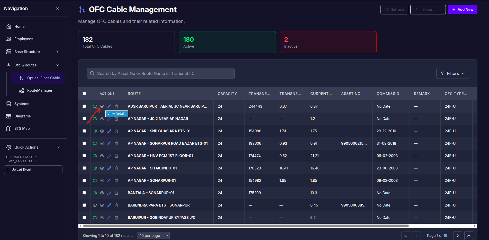
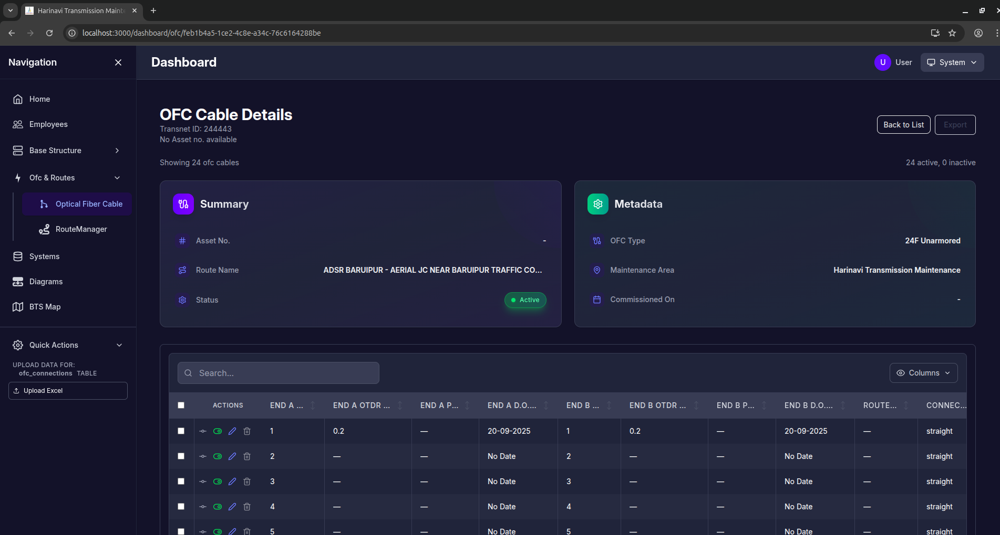
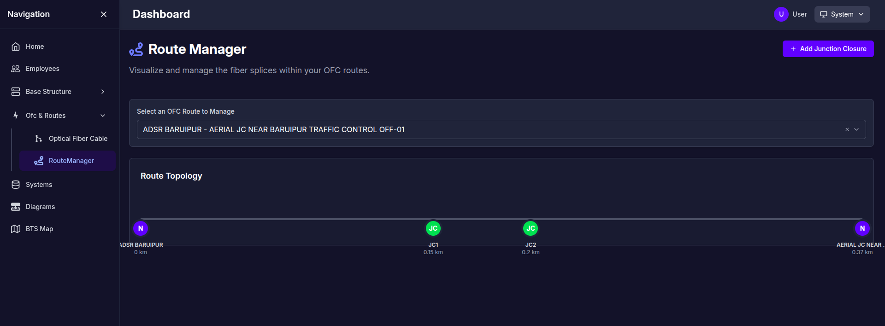
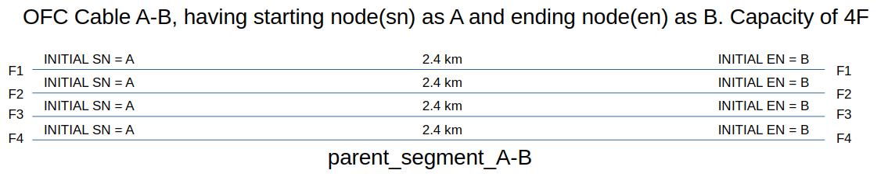
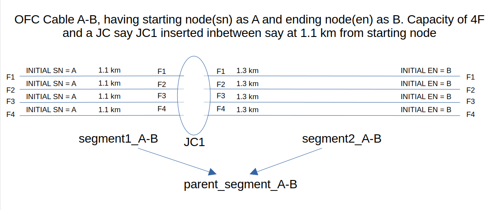
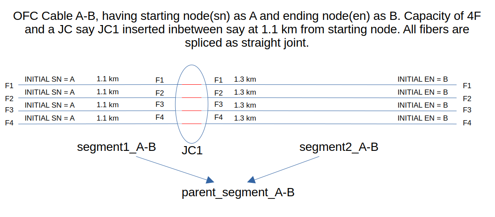
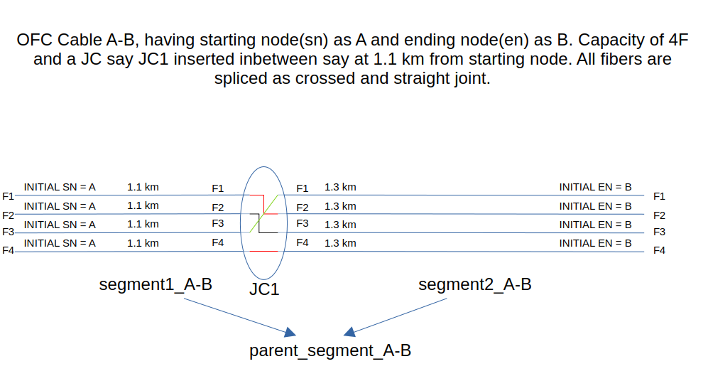
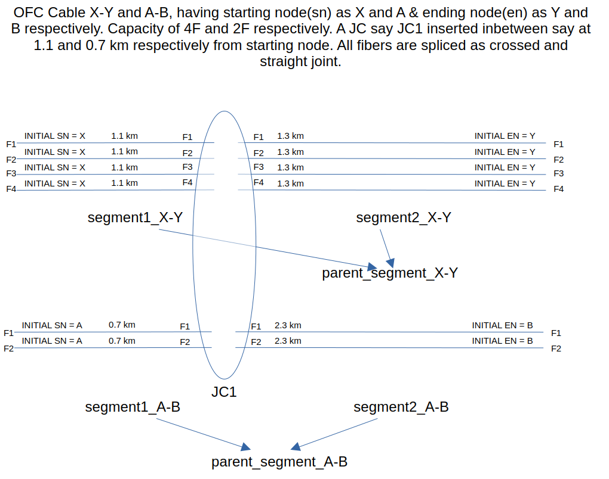
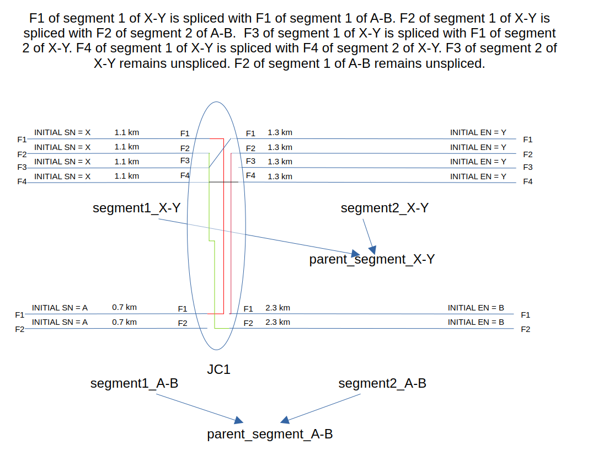
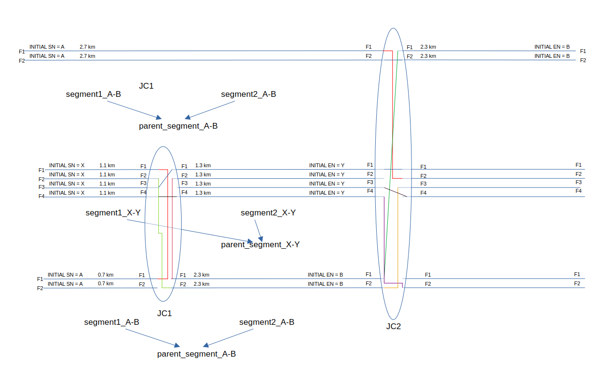

I have table ofc_cables

```sql
create table public.ofc_cables (
  id uuid not null default gen_random_uuid (),
  route_name text not null,
  sn_id uuid not null,
  en_id uuid not null,
  ofc_type_id uuid not null,
  capacity integer not null,
  ofc_owner_id uuid not null,
  current_rkm numeric(10, 3) null,
  transnet_id text null,
  transnet_rkm numeric(10, 3) null,
  asset_no text null,
  maintenance_terminal_id uuid null,
  commissioned_on date null,
  remark text null,
  status boolean null default true,
  created_at timestamp with time zone null default now(),
  updated_at timestamp with time zone null default now(),
  constraint ofc_cables_pkey primary key (id),
  constraint ofc_cables_en_id_fkey foreign KEY (en_id) references nodes (id),
  constraint ofc_cables_maintenance_terminal_id_fkey foreign KEY (maintenance_terminal_id) references maintenance_areas (id),
  constraint ofc_cables_ofc_owner_id_fkey foreign KEY (ofc_owner_id) references lookup_types (id),
  constraint ofc_cables_ofc_type_id_fkey foreign KEY (ofc_type_id) references lookup_types (id),
  constraint ofc_cables_sn_id_fkey foreign KEY (sn_id) references nodes (id)
) TABLESPACE pg_default;

create index IF not exists idx_ofc_cables_remark_fts on public.ofc_cables using gin (to_tsvector('english'::regconfig, remark)) TABLESPACE pg_default;

create trigger ofc_cables_log_trigger
after INSERT
or DELETE
or
update on ofc_cables for EACH row
execute FUNCTION log_data_changes ();

create trigger trigger_ofc_cables_updated_at BEFORE
update on ofc_cables for EACH row
execute FUNCTION update_updated_at_column ();
```

and other table ofc_connections which gives connections/details for each ofc_cables

```sql
create table public.ofc_connections (
  id uuid not null default gen_random_uuid (),
  ofc_id uuid not null,
  fiber_no_sn integer not null,
  fiber_no_en integer not null,
  otdr_distance_sn_km numeric(10, 3) null,
  sn_dom date null,
  sn_power_dbm numeric(10, 3) null,
  system_id uuid null,
  otdr_distance_en_km numeric(10, 3) null,
  en_dom date null,
  en_power_dbm numeric(10, 3) null,
  route_loss_db numeric(10, 3) null,
  logical_path_id uuid null,
  fiber_role text null,
  path_segment_order integer null default 1,
  source_port text null,
  destination_port text null,
  connection_category text not null default 'OFC_JOINT_TYPES'::text,
  connection_type text not null default 'straight'::text,
  remark text null,
  status boolean null default true,
  created_at timestamp with time zone null default now(),
  updated_at timestamp with time zone null default now(),
  constraint ofc_connections_pkey primary key (id),
  constraint fk_connection_type foreign KEY (connection_category, connection_type) references lookup_types (category, name),
  constraint fk_ofc_connections_logical_path foreign KEY (logical_path_id) references logical_fiber_paths (id) on delete set null,
  constraint fk_ofc_connections_system foreign KEY (system_id) references systems (id) on delete set null,
  constraint ofc_connections_ofc_id_fkey foreign KEY (ofc_id) references ofc_cables (id),
  constraint ofc_connections_fiber_role_check check (
    (
      fiber_role = any (array['working'::text, 'protection'::text])
    )
  )
) TABLESPACE pg_default;

create index IF not exists idx_ofc_connections_ofc_id on public.ofc_connections using btree (ofc_id) TABLESPACE pg_default;

create index IF not exists idx_ofc_connections_system_id on public.ofc_connections using btree (system_id) TABLESPACE pg_default;

create index IF not exists idx_ofc_connections_logical_path_id on public.ofc_connections using btree (logical_path_id) TABLESPACE pg_default;

create index IF not exists idx_ofc_connections_remark_fts on public.ofc_connections using gin (to_tsvector('english'::regconfig, remark)) TABLESPACE pg_default;

create trigger ofc_connections_log_trigger
after INSERT
or DELETE
or
update on ofc_connections for EACH row
execute FUNCTION log_data_changes ();

create trigger trigger_ofc_connections_updated_at BEFORE
update on ofc_connections for EACH row
execute FUNCTION update_updated_at_column ();

create trigger trigger_update_en_dom_on_otdr_change BEFORE
update on ofc_connections for EACH row
execute FUNCTION update_en_dom_on_otdr_change ();

create trigger trigger_update_sn_dom_on_otdr_change BEFORE
update on ofc_connections for EACH row
execute FUNCTION update_sn_dom_on_otdr_change ();
```



On clicking view button on ofc_cables page as shown above picture,we go to ofc connections/details page as in below picture. On clicking view and going to ofc connections/details page, we create fibers equal to capacity of cable(if already not created).



in route manager we can select any ofc_cables from dropdown. Then add as much JC as required. Example shown in below image



Above things are already implemented.

- **Now, Let us see what we want to implement/achieve.**

Suppose We are having a cable A-B of capacity 4 fiber and distance 2.4 Km. Then its ofc connections can be as in below picture.



Initially ofc connections will have a default segment path and initial starting and ending node as ofc cable.
Now if JC is added in-between, then fibers(ofc connections) will breaks at that JC and two new segments will be created with parent segment as initial one. Initial fiber length for the segments will also get updated



- Now lets see cases of splicing

- Case 1: Straight joint to all fibers at JC. This will result in no change in sn,en and Fiber numbers of the ofc_connections as shown below



- Case 2: Cross joint between fibers at JC. This will result in no change in sn,en but change in Fiber numbers of the ofc_connections as shown below



Here end to end fiber numbers in ofc_connections table will change as

|  sn Fiber Number |  en fiber number |
|---|---|
|  1 |  2 |
|  2 |  3 |
|  3 |  1 |
|  4 |  4 |

- Case 3: If same JC introduced on another cable, then two segments will be created for that also. For example, say there are two cables X-Y (capacity 4) and A-B (capacity 2). then segments will be



Lets assume that splicing is as below:




so, here will be end to end fiber numbers in ofc_connections tables

ofc connections table for X-Y

|  sn |  sn fiber number |  en |  en fiber number |
|---|---|---|---|
|  X |  1 |  A |  1 |
|  X |  2 |  B |  2 |
|  X |  3 |  Y |  1 |
|  X |  4 |  Y |  4 |
|   |   |  Y |  3 |

ofc connections table for A-B

|  sn |  sn fiber number |  en |  en fiber number |
|---|---|---|---|
|  A |  1 |  X |  1 |
|  A |  2 |   |   |
|  Y |  2 |  B |  1 |
|  X |  2 |  B |  2 |


 
I have shown only on JC, there can be many JCs with different situations.




